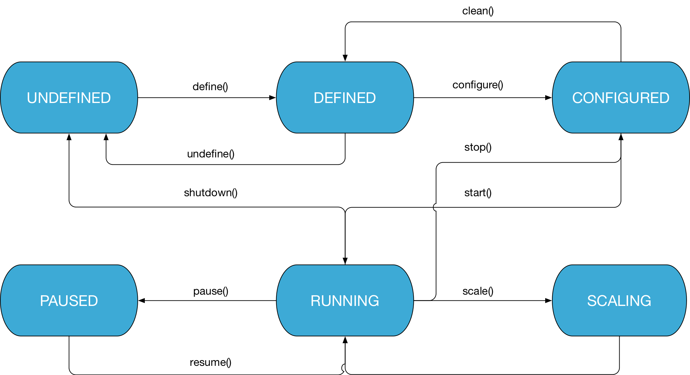

# Fog05 Node FSM

###### Update 31/10/2017

Here some points to the Application (graph of entity or other applications) states in Fog05.

Each Application can have one of this six states:

- UNDEFINED
- DEFINED
- CONFIGURED
- RUNNING
- PAUSED
- SCALING

The means of the state is the same defined in the [Entity FSM](./Fog05_Entity_FSM.md)