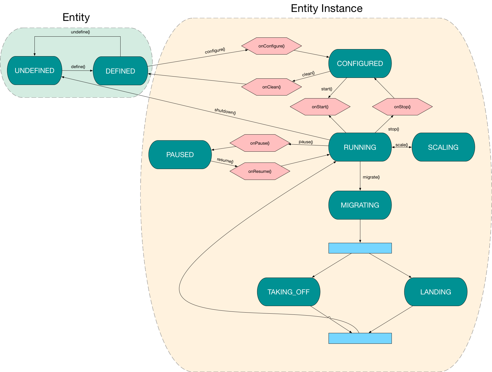
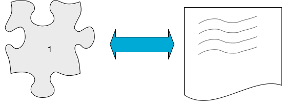
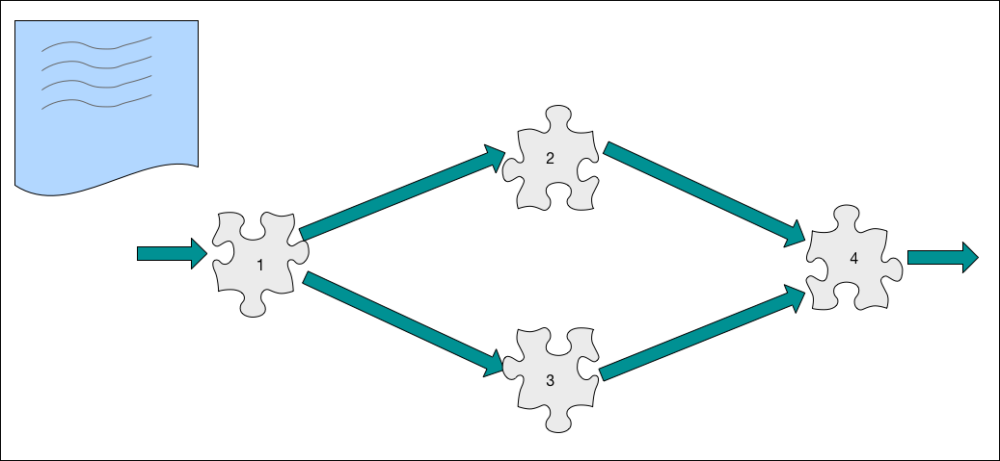

# Fog05 Entity FSM

###### Update 30/10/2017

Here some points to the Entity (VM/unikernel/container/miscroservice/ros2/...) states in Fog05.

Each Entity can have 9 states (the marine green ones):

- UNDEFINED
- DEFINED
- CONFIGURED
- RUNNING
- PAUSED
- SCALING
- MIGRATING
- TAKING_OFF
- LANDING

Let's see in detail these states

### UNDEFINED

Each Entity start from an "UNDEFINED" state because initialy nothing as been defined.

### DEFINED

The definition can be made in several ways:

- ~From file (XML,YAML,JSON)~
- ~By parameters to the define() function~ -> This is what happens internally
- By writing the manifest JSON to the Desidered State Store of the destination agent

For the definition of microservices we think that each service should have a manifest file where are defined the constraints and the requirements (eg. the use of some HW accelerator or memory/storage constraints) 

And then should be a manifest file for the entire application in which are fenined the Affinity Class for each 
service (eg two or more services should be deployed on the same system) and the graph that describe the connection between the services (also describe the order in which the services should be deployed)

After the definition the Entity is in DEFINED state this means that if all constrains are supported (I do not know how to explain this) the Entity can be deployed, this means that is available in the 'catalog'
Each Entity should have a human readable name and an UUID to be identifiable.

A Entity in the DEFINED state can be undefined by calling some undefined() function so it return to the UNDEFINED 
state that means that the Entity simply not exist anymore, or it can be configured calling some configure() function.
If the Entity is a microservice should implement a callback onConfigure() that the microservice framework will call to let the Entity configure it self (can retrive the configuration from DDS o from HTTP depends on a developer choice).

### CONFIGURED

After that the Entity is in the CONFIGURED state (for a microserice this means that all configuration is load, for a VM/Container can mean that the appropriate resource have been created and configured [eg. disk files, network bridge]).
A Entity in CONFIGURED state can come back to DEFINED if a clean() function is called, in this case if the Entity is a microservice should implement an onClean() callback to correctly remove any configuration.

### RUNNING

If a start() function is called the Entity goes to the RUNNING state, if the Entity is a microservice should implement a onStart() callback to initiate properly (eg. memory instantiation ...), for a VM/Container this is more easy because the VM/Container simply start (eg. using libvirt or docker api)

In the RUNNING the Entity is actualy running, there are some possible transitions, the Entity can come back to 
CONFIGURED if some stop() function is called, if the Entity is a microservice then a onStop() callback is used to proprely stop the service, it is possible also to come back directly to the DEFINED state with a shutdown() function, in this case everything in che Entity memory will be lost, it is like sending a SigKill, a Entity can also be paused this means that it will interrupt execution without being killed, so it can resume from the current state, can be scaled, in this case is very important that the FogAgent check if there are enough resource to scale.

### MIGRATING

A different situation is the migration, beacause, at first the FA should check if destination system is capable to 
handle a new Entity (eg. memory, disk,network, accelerators constraints) then if the migration in possible there will
 be actually two instance of the sane Entity running on two different systems, each instance as a different state, the
  source one is in TAKING_OFF state and after migration will arrive at UNDEFINED state (because it's no more avaiable 
  on the source system), the destination one is in LANDING state and after the migration will be in RUNNING state, for VM and Container migration should be free because should be provided by API (eg. libvirt or docker), for microservices they should implement two callbacks:

- beforeMigration() -> in which the microservice save is state and give them to the framework
- afterMigration() -> called by the framework to restore the state

Data from VM/Container and microservices states and manifest files should be transferred using the control plane.

 