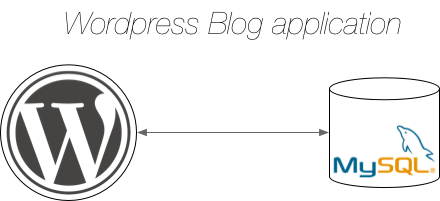

# Service Definition

To deploy a complex application/service the first thing to do is to define a manifest file,
those file should contain all information needed to correctly deploy the application/service,
so it should describe all entities and dependencies between these entities that compose the application/service.
We can also have an application that is composed by other applications.
---

### Application/Service manifest file

This file describe how to deploy the application/service, so it should contain:

- description of application/service
- entities that compose the application/service (eg. database server, http server...)
- relations and constraints between entities
- path to manifest files of components

So this describe the "graph" of the application/service
Then with this file the agent can decide where deploy the application/service

---

### Component manifest file

This file describe the single component of an application/service so it should describe
some low level information needed to deploy the component, so it should contain:

- description of component
- entity type (vm, unikernel, , µSvc, Ros Nodelet, native app...)
- entity description (depend on entity type)
- eventual need of hw acceleration or specific I/O

---

Should be agent's work to start the components in the correct order and with correct relations

---

##### Examples

Example of a simple 'complex' application: a Wordpress blog

    @GB: In the case of a service should have some information on how to scale
     I think we can add another key in the json "proximity" that is a dictionary in
     which the key is the name of the other components, and the value is an int that 
     rappresent the Proximity Class (lower is closer)
     eg. if value is 0 the component should be deployed in the same node
     

To define the application you can do a put to ~`dfos://<sys-id>/nodeid/applications/application_uuid/`~

    @GB: to have a more generic architecture during the definition we can do a put to
         dfos://<sys-id>/nodeid/onboard/application_uuid/
         The use the same [entity definition json](../json_objects/entity_definition.schema)
         And inside entity_data we can have that contains the manifest, in this
         way is very easy to define application/entity/systems (graph of applications)

 
Application manifest:

    @GB: updated this with new definition, this is inside an entity definition json, with type application
    

    {
        "name":"wp_blog"
        "description":"simple wordpress blog",
        "uuid":"application uuid",
        "components":[
            {
                "name":"wordpress",
                "need":["mysql"],
                "proximity":{"mysql":3}
                "manifest":"fos://sys-id/node-id/onboard/appuuid/component_name"
            },
            {
                "name":"mysql",
                "need":[],
                "proximity":{},
                "manifest":"fos://sys-id/node-id/onboard/appuuid/component_name"
            }
        ]
    }

    @GB: Manifest of the components are simply entity definition jsons, so you can nest application inside applications,
         or you can link application with simple entity

Wordpress manifest:

    {
        "name":"wp_v2.foo.bar"
        "description":"wordpress blog engine",
        "version": 2,
        "type":"container",
        "entity_description":{...},
        "accelerators":[]
        "io":[]
    }

    @GB: Should type match the runtime type? eg. kvm -> vm; lxc -> container and so on?
    In this way should be easy for the agent to lookup if the appropriate plugin in present
    or to recover and install that

mysql manifest file:

    {
        "name":"myql_v2.foo.bar"
        "description":"mysql db engine",
        "version" : 3,
        "type":"vm",
        "entity_description":{...},  <- here all information to download and configure the db server
        "accelerators":[]
        "io":[]
    }
 