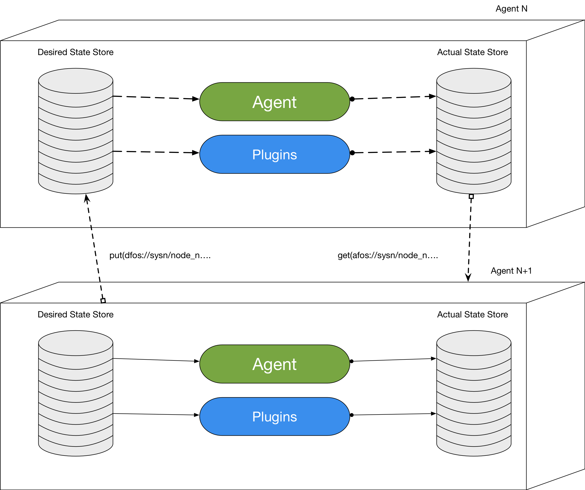

#URI definition

###### updated 30/10/2017

Because we want to share all possibile information through our distributed cache (K,V cache), URI are very important as they are the key for our cache.

The store is divided in two parts, one for store the desidered state of the node/entity/plugin, and one for store the
 actual state of the node/plugin/entity.
 
 Assuming this means that plugins and agent work to make the actual state match the desidered state.
 The actual state can be written only by the node that owns it, so only plugins and agent of that node can update its
  actual store, instead the desidered store can be written by all nodes, and readed only by the agent and plugins of 
  the node that own the store.
  
  Thinking in this way is very simple to register an observer on some remote entity for looking if state changes, and
   also make consistency of the data written to the actual store, because only the owner of the store can change 
   these data.
   So all requests should be written in the Desidered State Store, and all information should be readed from the 
   Actual Store Cache.
   
   See the following image:
   

## So let's see some examples:

##### Looking for all nodes in a system
`<a|d>fos://<system_id>/`

##### Looking for basic information about all nodes in the system
`<a|d>fos://<system_id>/**`

##### Add a plugin to a node
`dfos://<system_id>/<node_id>/plugins` 

Then the value should be a JSON object with all information that permitt to get and install the plugin

		@AC: I think the URI for adding a plugin should be as follows:
		
			pput(`fos://<system_id>/<node_id>/plugins/<plugin-name>`, plug-in-descr)
			
		As adding this URI to the cache has the effect of "registering" the plugin.
		
			
###### Interact with a runtime
`dfos://<system_id>/<node_id>/runtime/<runtime_id>/$action_to_runtime` 

	@GB: see comments below, all actions become desidered state and are passed through the JSON parameter

###### Create a new entity
`dfos://<system_id>/<node_id>/runtime/<runtime_id>/entity/$create_entity` 

And the value should be a JSON with all information about this entity

		@AC: Same comment here, the result of a put is equivalent to create
		a new entity. Likewise the remove operation should dispose the entity.
		
		@GB: This become something like:
		pput('dfos://<system_id>/<node_id>/runtime/<runtime_id>/entity/',{'status':define ... })
		and all entity information are into the JSON
		

##### Interact with an entity
`dfos://<system_id>/<node_id>/runtime/<runtime_id>/entity/<entity_id>$action_to_entity`

In this case `action` can be very different things, depend on entity type (vm, unikernel, native app, µSvc...) and can need some value in form of a JSON object

	@AC: If embed actions in the URI I don't think that these should be part of the 
	key used to inster the value in the cache. In other terms, for the URI below:
	
		`fdos://<system_id>/<node_id>/runtime/<runtime_id>/entity/<entity_id>$action_to_entity`
		
		The key used by the cache should be only:
		
		`dfos://<system_id>/<node_id>/runtime/<runtime_id>/entity/<entity_id>`

	The value associated with a specific key K should represent the desired state for 
	the a specific resource.
	
	@GB: As discussed can we use 
	
	`dfos://<system_id>/<node_id>/runtime/<runtime_id>/entity/<entity_id>` as key
	
	and the previously defined 'action' become part of the JSON send in the put() or pput()
	
	in a way that we don't have actions inside the uri, but they rappresent a desidered state for that resource
	
	so as example:
	
	previously uri: pput('dfos://<system_id>/<node_id>/runtime/<runtime_id>/entity/<entity_id>$run')
	now uri: pput('dfos://<system_id>/<node_id>/runtime/<runtime_id>/entity/<entity_id>',{'status':run ... })
	
	
	
## Definition

So after this example we can try to define a more general URI scheme for FogOS

`
<a|d>fos://<system_id>/<node_id>/<type_of_resource>/<id_of_resource>/<type_of_subresource>/<id_of_subresource>
`

> It is possible to get basic information about all nodes/entity/... at every level by using `**`, where id is required is possible to use wildcard `*` or list of ids
>
> ~~At each level is possible to have `['$'action]['?'query]['#'fragment]`~~ 
>
> At each level is possible to have `['?'query]['#'fragment]`
>
>`<type_of_resource>` can be: 
>
> * plugin
> * runtime
> * network
> * os
>
> `<type_of_subresource>` depend on resource type
> 
> eg for network can be 
> 
> * virtual_network
> * virtual_bridge
> * virtual_interface
> 
> ~~action,~~ query and fragment depend on level
>
> Action are part of the JSON Object, see below some JSON object types
> 
> At node level is possible to monitor information about a node and manage is lifecycle, the same is possible at id_of_resource level and id_of_subresource level
>
> All values must be JSON objects

---

#### JSON Types
--

Here some JSON object types

### Plugin Interaction
URI: `<a|d>fos://<system_id>/<node_id>/plugins/<plugin-name>/<uuid>`

##### Add a plugin

	{
		"status": "add",
		"version" : plugin_version,
		"description" : brief plugin description,
		"uuid" : should plugin have an uuid? maybe for locating it
    }
    
    pput(dfos://<system_id>/<node_id>/plugins/<plugin-name>/<uuid>)
    
    pput because you maybe don't know if a node has loaded other plugins 

##### Remove a plugin

    remove('dfos://<system_id>/<node_id>/plugins/<plugin-name>/<uuid>')
    
    
##### Update a plugin

        @ AC this primitive is equivalente to a 'put' followed by a 'remove', thus not essential.
         
	{
		"status" : "update",
		"version": plugin_version,
		"uuid": uuid
    }
    
    
 ---
 
### Runtime Interaction
 
 URI: `u<a|d>fos://<system_id>/<node_id>/rntime/<runtime_id>/entity/<entity-uuid>`
 
##### Create an Entity

	{
		"status" : "define",
		"name" : entity_name,
		"version" : entity_version
		"entity_data" : this should depend on entity type (vm/container/µSvc,...) and should containt information about how and where recover the entity
    }
    
    put(dfos://<system_id>/<node_id>/rntime/<runtime_id>/entity/<entity-uuid>)
  
### Entity Interaction

 URI: `dfos://<system_id>/<node_id>/runtime/<runtime_id>/entity/<entity_id>#status=run&entity_data.memory=2GB
  
   
 dput('dfos://<system_id>/<node_id>/runtime/<runtime_id>/entity/<entity_id>#status=run&entity_data.memory=2GB')
 
 dput('dfos://<system_id>/<node_id>/runtime/<runtime_id>/entity/<entity_id>, "{status=run, entity_data.memory=2GB }")
 
  
##### Configure an Entity

	{
		"status" : "configure",
    }

When an entity is configured should we say that there is an instance of that entity?
eg. if entity is a vm I can define the let's say 'base image and requirements', and when is configured all disks are created, and libvirt xml in also created, so this is an instance of the entity or is the entity itself?

  
##### Run an Entity

	{
		"status" : "run",
    }

##### Stop an Entity

	{
		"status" : "stop",
    }

##### Pause an Entity

	{
		"status" : "pause",
    }

##### Resume an Entity

	{
		"status" : "resume",
    } 
    
##### Scale an Entity

	{
		"status" : "scale",
		"scale_data" : depends on entity type 
    }
    
##### Migrate an Entity

	{
		"status" : "migrate",
		"dst_node" : destination node uuid,
		"type" : migration type (live, non live)
    }
    
##### Undefine an Entity
    
    remove(dfos://<system_id>/<node_id>/runtime/<runtime_id>/entity/<entity_id>)