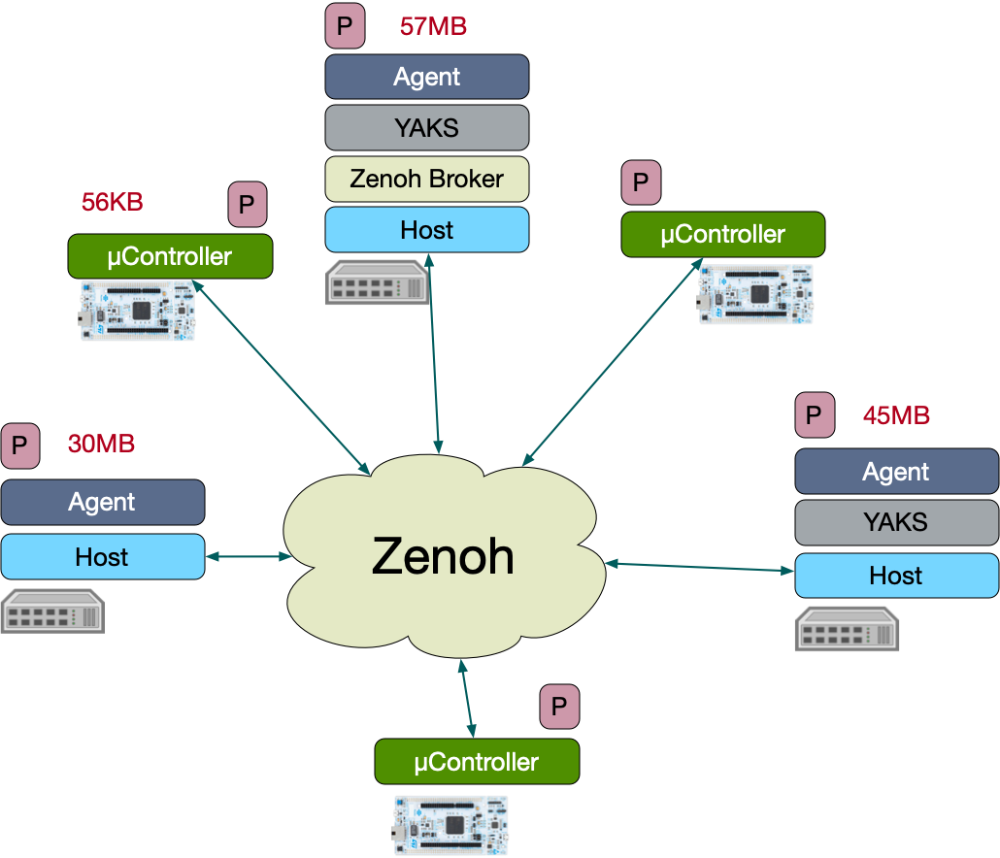

# The Fog Infrastructure Manager (FIM)

The Eclipse fog05 Fog Infrastructure Manager (FIM) module virtualises the hardware infrastructure, such as computational, communication, storage and I/O resources. It provides key primitives for the management of the infrastructure and the application deployed in it.

It also provide a set of abstraction. The FIM is designed to be distributed, without any controller node. The system state is managed in a location-transparent manner leveraging Zenoh for data distribution and sharing across the system.

The FIM is designed to leverages plugins for most of its functionalities, in Eclipse fog05 different kinds of plugin can be used.
- OS Plugin
- Network Manager Plugin
- Runtime Plugin
- Device Plugin

To kick off our tour of Eclipse fog05 and to demonstrate use and access of the Fog Infrastructure Manager, we will start with the obligatory “hello world” example. This example will deploy a docker container that just prints ["Hello World"!](./fim_hello_world.md).

