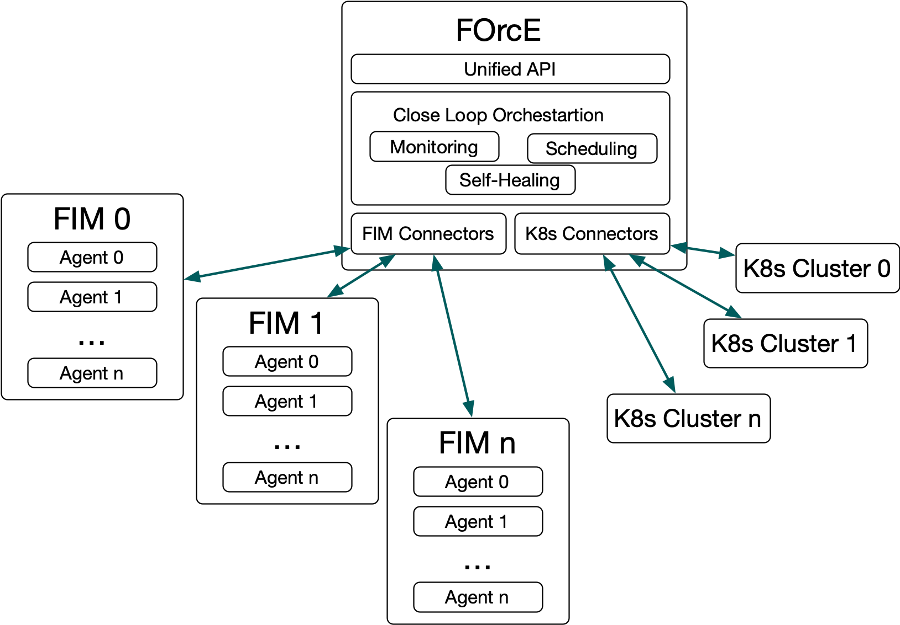

# The Fog Orchestration Engine (FOrcE)

The Eclipse fog05 Fog Orchestration Engine (FOrcE) is responsible for the end-to-end orchestration and management of applications and services in the Fog infrastructure. It enforces the constraints defined by the application/service and provides an allocation algorithm for the components of an application/service. This component leverages on state distribution and location-transparent data access for its functionalities.

It is able to instantiate deployments on a Kubernetes cluster hence enabling End-to-End services composed by both fog05's FDUs and Kubernetes deployments.

FOrcE architecture is illustrated in the picture below:

It consist of:

- An unified API able to cover both fog05 and Kubernetes concepts.
- A Close Loop Orchestration Engine that monitors, schedules and provide a replica-based self-healing mechanism to the deployed applications.
- A set of connectors to communicate with different FIM deployments and Kubernetes clusters.
- Users interact with FOrcE by the means of fosctl a command line utility that uses FOrcE's REST interface for interaction.

In this chapter, we’ll see how to:

- [Install](./force_install.md) Eclipse fog05 FOrcE
- [Start](./force_start.md) the Eclipse fog05 FOrcE