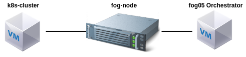

# Eclipse fog05 & Kubernetes

In this chapter we illustrate how to integrate Eclipse fog05 & Kubernetes

## Main components

- A [microK8s](https://microk8s.io/) cluster
- Am Eclipse fog05 orchestrator [FOrcE](https://fog05.io/docs/getting-started/force-installation/)
- An application deployment k8s descriptor in json

## Integration step-by-step

- We [connect](./connect_cloud.md) our fog05 orchestration with the k8s cluster
- We [create](./descriptor_ek8s.md) the fog05 descriptor that embeds the k8s descriptor
- We [instantiate](./instantiate_ek8s.md) it via fog05 orchestration
- We [check](./monitor.md) that the application deployed in k8s
