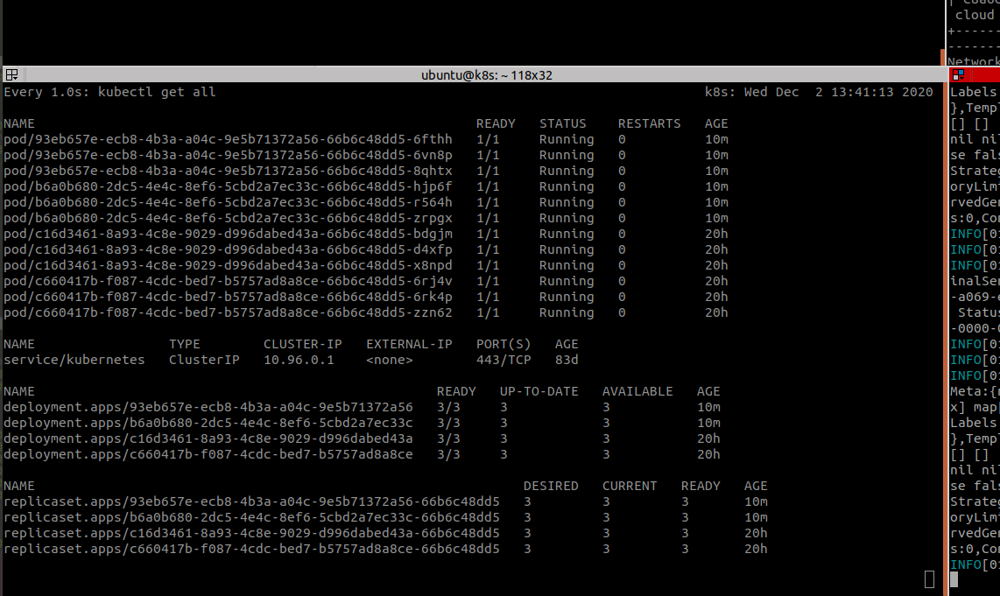

# Check the application is deployed in the k8s cluster


During all this exercise we can monitor what is happening in the k8s cluster, by running:

```sh
watch -n1 kubectl get all
```

Showing the respective changes that have been done to the k8s cluster from the force orchestrator node via fosctl.

